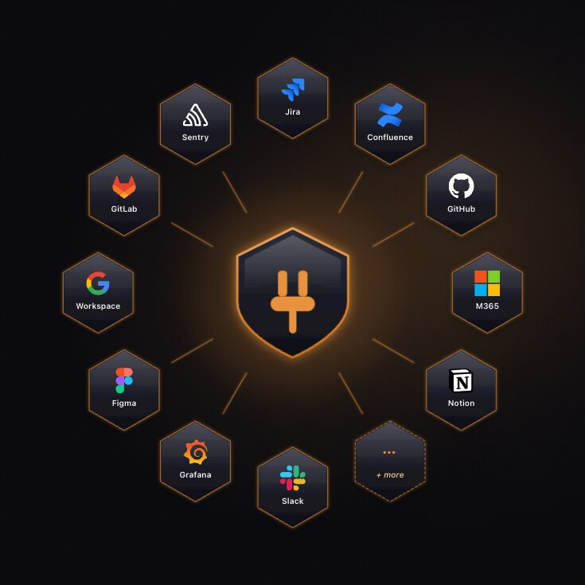
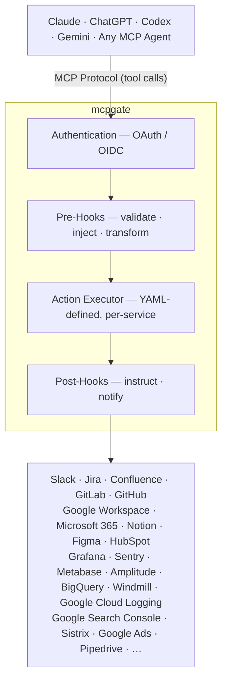

# mcpgate — Privacy-First Self-Hosted MCP Gateway

> Connect Claude, ChatGPT, Codex, Gemini, and any MCP-compatible agent to **38 enterprise tools** (Jira, GitLab, GitHub, Notion, Confluence, Slack, Google Workspace, Microsoft 365, HubSpot, Pipedrive, Windmill, Google Cloud Logging, Google Ads, Grafana, Sentry, Figma, Miro, …) through a single self-hosted MCP gateway. Built-in **PII pseudonymization** with on-prem rehydration, **two-layer policy hooks** (company + user, YAML, hot-reloaded), and a gateway-served **Context Map** so your agents answer with your company's wiring instead of guessing. Zero data at rest, BSL 1.1 license (free for up to 5 users).

[Website](https://mcpgate.de) · [Docs](https://mcpgate.de/docs/) · [Demo](https://demo.mcpgate.de) · [Pricing](https://mcpgate.de/pricing/) · [Compare](https://mcpgate.de/compare/) · [Docker Hub](https://hub.docker.com/r/mcpgate/mcpgate)

[](LICENSE) [](https://mcpgate.de/docs/quickstart/) [](https://hub.docker.com/r/mcpgate/mcpgate)



This repository contains the self-hosting distribution for mcpgate: Docker Compose, configuration templates, hooks, and operations docs. Published container images are released via the CI/CD pipeline connected to this repository.


A PM finishes a user interview and asks Claude to consolidate his notes in Notion. (Works the same with ChatGPT, Codex, or any MCP-compatible agent.) After reviewing them, he saves the key takeaways to the insights database and frames an opportunity for the next product meeting. What used to take the rest of the day is done in 15 minutes.

Weeks later, the product team decides to prioritize that opportunity. The PM gives the AI the full context, adds constraints, and starts prototyping. The AI pulls the codebase, scaffolds a working prototype, and the PM iterates on the actual problem — not on tooling. A few hours later, the prototype integrates with the existing app and the design system, because the AI had the context to do it right. Changes are saved to a Git branch automatically.

With all that context loaded, the AI drafts Jira tickets for the refinement. Hooks handle the boring parts — converting Markdown to Jira's ADF format, enforcing required fields, and blocking accidental overwrites. When the team meets, they walk through a working prototype, identify gaps, and make it actionable. Design, development, QA — everyone picks up where the last person left off, with full context.

mcpgate connects your tools to your AI — Notion, Jira, GitLab, Figma, HubSpot, Pipedrive, Windmill, and many more. 38 integrations are built in, and you can add your own through OpenAPI import. Company hooks enforce your policies, while user hooks let individuals fine-tune rules directly from their AI client — hot-reloaded in seconds. mcpgate works as an MCP gateway, but also as a gate: your rules, your data. Eliminate loops between teams, safely manage context across handoffs, and let your team focus on building.

AI transformation is happening. Your tools, your data, and your context need to be connected — mcpgate is how you do it on your terms.

## Quick Start

```bash
docker compose up -d
open http://localhost:8642
```

That's it. No `.env` file needed. The setup wizard walks you through login, branding, team, and connecting services. Secrets are auto-generated on first start.

> **New here?** Clone the repo to get the pre-configured `docker-compose.yml`:
> ```bash
> git clone https://gitlab.com/mcpgate/mcpgate.git && cd mcpgate
> ```
> Or copy the `docker-compose.yml` from [mcpgate.de/docs/quickstart](https://mcpgate.de/docs/quickstart).

> **Already have an `.env`?** It still works — environment variables take priority over wizard config.

## Connect your AI

After setup, connect your AI client from the dashboard:

### Claude — Company-wide (recommended)

Configure once at [**claude.ai/admin-settings/connectors**](https://claude.ai/admin-settings/connectors):

```
Name: mcpgate
URL:  https://your-gateway-url/mcp
```

### Claude Code

```bash
claude mcp add mcpgate https://your-gateway-url/mcp -s user -t http
```

### ChatGPT

Settings → Apps → Add App → OAuth → enter your MCP URL.

### Codex / Gemini CLI

```bash
codex mcp add mcpgate --url https://your-gateway-url/mcp
gemini mcp add --transport http mcpgate https://your-gateway-url/mcp
```

## Architecture



**How a request flows:**

1. AI sends a tool call via MCP (e.g. `jira_write_actions` → `create_issue`)
2. mcpgate authenticates the user via OAuth/OIDC
3. **Pre-hooks** run: validate permissions, block destructive actions, transform data (e.g. Markdown → Jira ADF)
4. Action executes against the service API using per-user OAuth tokens
5. **Post-hooks** run: cap response size, add display hints — and optionally **chain follow-up actions** (e.g. post a Slack notification after a Jira issue is created)
6. Result returns to the AI client

## Authentication

| Method | Use case |
|--------|----------|
| **Broker login** | Google/Microsoft sign-in, zero config (default) |
| **OIDC SSO** | Your own identity provider (Google, Microsoft, Okta, Keycloak, Auth0). New users provisioned automatically &mdash; no separate user table to maintain. |
| **Magic Links** | Email-based login for external collaborators |

SSO and service credentials are configured through the setup wizard or `.env`. See `.env.example` for the full reference.

## Services

Enable a service by entering credentials in the setup wizard or `.env`. Only configured services activate. The table below is the **curated** surface — each service also exposes a long-tail of auto-generated actions discovered on demand (see "Long-tail discovery" below).

### Productivity & Collaboration

| Service | What your agent can do |
|---------|-------------------------|
| **Google Workspace** | Gmail, Calendar, Drive, Docs, Sheets, Slides |
| **Microsoft 365** | Outlook, Teams, OneDrive, SharePoint, Calendar, Excel |
| **Slack** | Search messages, read channels, post messages, manage reminders |
| **Notion** | Pages, databases, blocks, comments, file uploads |
| **Notion MCP** | Notion's hosted MCP server — full-content and Notion AI search |
| **Confluence** | Spaces, pages, comments, CQL search |

### Engineering & Operations

| Service | What your agent can do |
|---------|-------------------------|
| **Jira** | Create/update issues, transitions, worklogs, sprints, comments |
| **GitLab** | Issues, merge requests, pipelines, deployments, CI/CD variables, code search |
| **GitHub** | Issues, pull requests, releases, code search across repositories |
| **Jenkins** | Builds, pipelines, job triggers, log reading |
| **Sentry** | Error tracking, issue queries, releases, statistics |
| **Grafana** | Dashboards, Loki log search, alert history, metrics |
| **Google Cloud Logging** | Read Cloud Logging entries and Cloud Audit Logs (who did what, when) for the GCP projects your account can access |
| **Windmill** | Trigger scripts, flows and endpoints in your Windmill instance — via Windmill's hosted MCP server |
| **Bug & Feature Reports** | Let users file bug reports and feature requests via the agent |

### Marketing, SEO & Analytics

| Service | What your agent can do |
|---------|-------------------------|
| **Google Search Console** | Search analytics, URL inspection, sitemap management, indexing requests |
| **Sistrix** | Visibility Index, keyword rankings, SERP changes, competitor backlinks |
| **BigQuery** | SQL queries against your data warehouse (Adjust, GA exports, business reports) |
| **Google Ads** | Accounts, campaigns, ad groups, ad performance and reporting (read-only) |
| **Google Analytics** | GA4 traffic, engagement and conversion reports, realtime data |
| **Google Tag Manager** | Containers, workspaces, tags, triggers, variables — publishing stays a human step in the GTM UI |
| **Bing Webmaster** | Bing/Copilot search performance, query & page stats, crawl/index data |
| **Amplitude** | Charts, active users, cohorts, experiments, session replays |
| **Metabase** | BI dashboards, native SQL, schema exploration |

### Sales & CRM

| Service | What your agent can do |
|---------|-------------------------|
| **HubSpot** | Contacts, companies, deals, tickets, engagement activities — via HubSpot's MCP server |
| **Pipedrive** | Deals, persons, organizations, activities, pipelines, leads, notes |

### Design & Creative

| Service | What your agent can do |
|---------|-------------------------|
| **Figma** | Files, components, styles, comments, dev resources |
| **Figma MCP** | Figma's hosted MCP server — design-to-code context, design tokens, write-to-canvas |
| **Miro** | Boards, diagrams, docs, comments, widgets (via the official Miro MCP server) |
| **Supernova** | Design tokens, components, documentation |

### Workplace & Content

| Service | What your agent can do |
|---------|-------------------------|
| **WordPress** | Posts, pages, Yoast SEO metadata (multi-instance) |
| **Transifex** | Translation projects, strings, languages, reviews |
| **Home Assistant** | Office sensors, heating control |
| **Joan** | Desk & meeting room booking |

### App Stores

| Service | What your agent can do |
|---------|-------------------------|
| **AppStore Connect** | App reviews, ratings, versions, builds, TestFlight testers |
| **Google Play** | Android app reviews, ratings, release track management |
| **Google Play Vitals** | Android crash rate, ANR rate, errors and performance metrics (daily) |
| **Google Play Reports** | Play Console download reports — installs, store performance, acquisitions (CSV) |

Plus self-management tools (gateway config, issue reporting) and OpenAPI import for anything else. See [`docs/services/`](https://mcpgate.de/docs/services/) for example questions a customer can ask their agent per service.

## Context Map

CI/CD for what your AI knows about your company. A curated Markdown corpus — which systems and repos exist, who owns what, how things connect — served from the gateway to every connected AI client. The gateway syncs and serves it; AI runs on the consumers, not on the map itself.

- **Anchor** — point the gateway at a git repo (audited, diffable, revertable) or paste content inline (zero git). A configurable poll keeps it fresh; an optional webhook with a per-tenant secret triggers immediate reindex. A content-push REST endpoint lets other systems POST entries directly.
- **`map_read`** — a new MCP tool every connected AI client gets. BM25 search over the page index; fetch a single page by id. A one-line session-hint nudges the model to consult the map for *where does X live / who owns it / how does it connect* questions instead of guessing.
- **Freshness rides every tool response** — a tiny version-key compare on each tool call; on change, the tag-scoped delta attaches to the tool's response once per session per change. Covers passthrough tools too (Jira, Slack, Notion, GitLab, …), so a working session notices a mid-session map change on its very next call — no client interrupt, no re-send.
- **Gap feed** — `map_read` queries that come back empty are logged to a bounded, de-duplicated, PII-scrubbed feed with frequency aggregation. The raw material for proposing new pages; nothing is written automatically.
- **`map_write`** — AI agents can correct stale pages directly. Every write (inline edit, content-push REST, `map_write`) passes the same gate: leak-scan + size/format validation + attribution. In repo mode the gateway commits and pushes through its own identity; the served copy reindexes immediately.
- **Operator-only by default** — the `map_read` / `map_write` tools and the freshness beacon are hidden from `external` / `viewer` roles. The admin viewer is XSS-hardened; git credential is tokenless at rest; only allowlisted git hosts accepted; symlink escapes refused and logged.

The whole point: shared organisational knowledge that personal AI memory can't solve, in plain text you own, kept fresh because the gateway notices when it gets used and what it misses.

See [`docs/admin/context-map/`](https://mcpgate.de/docs/admin/context-map/) for the full operator reference.

## Compliance & Safety

Built-in safeguards that don't need configuration:

- **PII Sanitization with Pseudonym Rehydration** — sensitive data (emails, names, phone numbers) is replaced with stable pseudonyms before it reaches the LLM, then rehydrated when the agent calls a tool. Mapping stays on-prem, encrypted at rest, and expires after 24h. Preserves write-flows that simple redaction would break.
- **Write-Safety Defaults** — destructive actions (delete, archive, dashboard PUTs) require explicit `confirmed=true` or `force=true`. Response size caps prevent accidental mass operations.
- **Stores nothing in transit** — mcpgate is a pass-through. Tool actions are auditable in your own tools (Jira, GitLab, Slack) where they happen. The only data we hold is the encrypted pseudonym mapping for PII rehydration, with a 24-hour TTL.
- **Highly available** — runs as multiple replicas behind your load balancer. Config changes propagate to all replicas in seconds.

## How mcpgate compares

The MCP-gateway space is crowded. The [`e2b-dev/awesome-mcp-gateways`](https://github.com/e2b-dev/awesome-mcp-gateways) catalog (April 2026) lists **21 open-source** and **23 commercial** entries, and that list isn't exhaustive — it doesn't include all the AI-runtime projects that ship gateway functionality. Most projects overlap on the routing surface; the meaningful differences are in license, deployment story, and what they do beyond routing.

A quick read against three named neighbors (figures verified 2026-05-17 via GitHub API):

| | mcpgate | [Obot](https://github.com/obot-platform/obot) | [Docker MCP Gateway](https://github.com/docker/mcp-gateway) | [IBM ContextForge](https://github.com/IBM/mcp-context-forge) |
|---|---|---|---|---|
| License | BSL 1.1 (free ≤5 users) | MIT | MIT | Apache-2.0 |
| Stage of life (stars / forks, 2026-05-17) | public since 2026-03, 1 reference customer | 777 / 164 | 1,392 / 244 | 3,719 / 661 |
| Self-hosted | ✅ | ✅ | ✅ (Docker CLI plugin) | ✅ |
| **PII pseudonymization with rehydration** | ✅ built-in | ❌ (not shipped — could be added on the OSS code) | ❌ (out of scope) | ❌ (not in README) |
| **User-level policy hooks** | ✅ YAML, hot-reloaded | ❌ (operator RBAC) | ❌ (profile allowlists) | RBAC via JWT scopes (operator) |
| Built-in service integrations | 29 (hand-written native YAML + official-MCP proxies) | curated set | composes from Docker MCP catalog (~200) | federated MCP / A2A / REST / gRPC |
| OAuth / DCR / PKCE / static-bearer / no-auth | unified | OAuth 2.1 | depends per server in catalog | unified, JWT-scoped |
| Kubernetes-native | possible, no official Helm chart | ✅ Helm chart | Docker-only (CE / Desktop) | ✅ + Helm + AWS / Azure / GCP / IBM Cloud / OpenShift |

The ❌ cells above are about what each project *ships out of the box*, not an architectural ceiling — Obot, Docker MCPG, and ContextForge are all open enough that any of those features can be built on top of them with engineering investment. The trade-off is who does the engineering and who carries the maintenance. Each comparison page on the website walks through that trade-off explicitly.

Detailed honest comparisons live on the website:
- [mcpgate vs Obot](https://mcpgate.de/compare/mcpgate-vs-obot/)
- [mcpgate vs Docker MCP Gateway](https://mcpgate.de/compare/mcpgate-vs-docker-mcp-gateway/)
- [All comparisons](https://mcpgate.de/compare/) (IBM ContextForge, MintMCP, Lunar.dev MCPX coming next)

Where another project is the better fit for your team, we say so.

## Hooks

Policy and enrichment hooks in `config/tool_hooks.yaml`:

- **Policy** (validation): destructive action confirmation, API endpoint guards, transition checks
- **Enrichment** (mutation): Markdown → ADF conversion, text normalization, auto-linking, templates
- **Post-processing** (observability): response capping, cross-service automation, auth error handling

Hooks handle deterministic guarantees — format conversion, write-safety, audit, PII handling. For preference- and workflow-shaped instructions (team templates, individual style), the MCP standard's emerging **Skills** mechanism ([SKILL.md format](https://agentskills.io)) is the right place. Hooks enforce; skills personalize.

> Heads-up: the MCP **Interceptors Working Group** ([SEP-1763](https://github.com/modelcontextprotocol/modelcontextprotocol/issues/1763), charter 2026-04-21) is standardizing exactly what mcpgate calls hooks today. The three Interceptor types — validation, mutation, observability — map 1:1 to our Policy / Enrichment / Post-Hooks. Once the SEP stabilizes we'll expose `interceptor/list` and friends as a thin adapter on top of the existing hook system.

Hot-reload without restart:

```bash
curl -X POST http://localhost:8642/admin/reload
```

See [OPERATIONS.md](OPERATIONS.md) for details.

## Customization

Branding, access control, and hooks are configurable through the setup wizard or config files. White-label the dashboard with your company name, logo, and colors.

## Updates

```bash
docker compose pull
docker compose up -d
```

## Configuration Reference

For advanced configuration, create a `.env` file from the template:

```bash
cp .env.example .env
```

See `.env.example` for all available options including OIDC, service credentials, AI features, and error reporting.

## Operations

See [OPERATIONS.md](OPERATIONS.md) for health checks, metrics, hot-reload, extensions, and troubleshooting.

## Support

Contact hello@mcpgate.de

## License

Business Source License 1.1. See [LICENSE](LICENSE).

Personal and internal business use permitted, including production. Offering mcpgate as a hosted service requires a commercial license. See [COMMERCIAL.md](COMMERCIAL.md).
