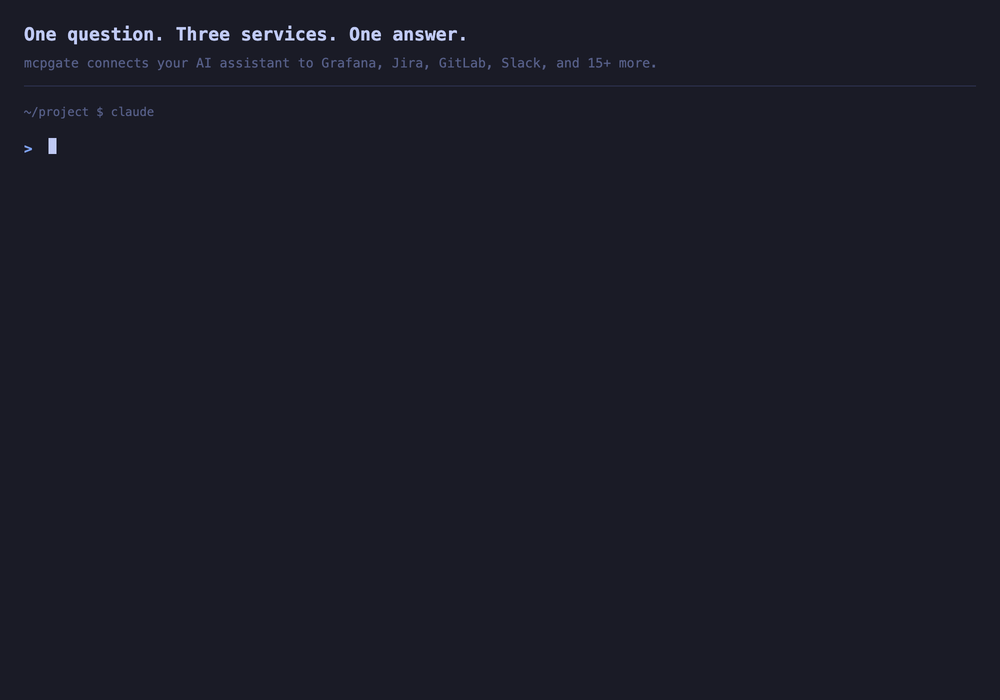
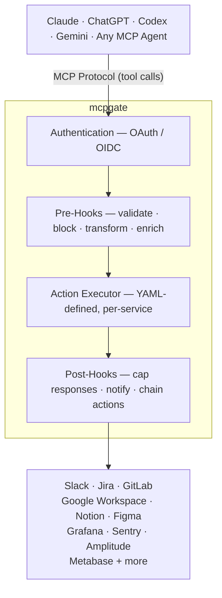

# mcpgate

Self-hosted MCP gateway — connect any AI to your company tools with policy hooks.

[Website](https://mcpgate.de) · [Docs](https://mcpgate.de/docs) · [Demo](https://demo.mcpgate.de) · [Docker Hub](https://hub.docker.com/r/mcpgate/mcpgate) · [Pricing](https://mcpgate.de/pricing)

This repository contains the self-hosting distribution for mcpgate: Docker Compose, configuration templates, hooks, and operations docs. Published container images are released via the CI/CD pipeline connected to this repository.



A PM finishes a user interview and asks Claude to consolidate his notes in Notion. (Works the same with ChatGPT, Codex, or any MCP-compatible agent.) After reviewing them, he saves the key takeaways to the insights database and frames an opportunity for the next product meeting. What used to take the rest of the day is done in 15 minutes.

Weeks later, the product team decides to prioritize that opportunity. The PM gives the AI the full context, adds constraints, and starts prototyping. The AI pulls the codebase, scaffolds a working prototype, and the PM iterates on the actual problem — not on tooling. A few hours later, the prototype integrates with the existing app and the design system, because the AI had the context to do it right. Changes are saved to a Git branch automatically.

With all that context loaded, the AI drafts Jira tickets for the refinement — written in the team's preferred style, thanks to hooks. When the team meets, they walk through a working prototype, identify gaps, and make it actionable. Design, development, QA — everyone picks up where the last person left off, with full context.

mcpgate connects your tools to your AI — Notion, Jira, GitLab, Figma, and many more. 20 integrations ship at launch, and you can add your own through OpenAPI import. Company hooks enforce your policies, while user hooks let individuals fine-tune rules directly from their AI client — hot-reloaded in seconds. mcpgate works as an MCP gateway, but also as a gate: your rules, your data. Eliminate loops between teams, safely manage context across handoffs, and let your team focus on building.

AI transformation is happening. Your tools, your data, and your context need to be connected — mcpgate is how you do it on your terms.

## Quick Start

```bash
docker compose up -d
open http://localhost:8642
```

That's it. No `.env` file needed. The setup wizard walks you through login, branding, team, and connecting services. Secrets are auto-generated on first start.

> **New here?** Clone the repo to get the pre-configured `docker-compose.yml`:
> ```bash
> git clone https://gitlab.com/mcpgate/mcpgate.git && cd mcpgate
> ```
> Or copy the `docker-compose.yml` from [mcpgate.de/docs/quickstart](https://mcpgate.de/docs/quickstart).

> **Already have an `.env`?** It still works — environment variables take priority over wizard config.

## Connect your AI

After setup, connect your AI client from the dashboard:

### Claude — Company-wide (recommended)

Configure once at [**claude.ai/admin-settings/connectors**](https://claude.ai/admin-settings/connectors):

```
Name: mcpgate
URL:  https://your-gateway-url/mcp
```

### Claude Code

```bash
claude mcp add mcpgate https://your-gateway-url/mcp -s user -t http
```

### ChatGPT

Settings → Apps → Add App → OAuth → enter your MCP URL.

### Codex / Gemini CLI

```bash
codex mcp add mcpgate --url https://your-gateway-url/mcp
gemini mcp add --transport http mcpgate https://your-gateway-url/mcp
```

## Architecture



**How a request flows:**

1. AI sends a tool call via MCP (e.g. `jira_write_actions` → `create_issue`)
2. mcpgate authenticates the user via OAuth/OIDC
3. **Pre-hooks** run: validate permissions, block destructive actions, transform data (e.g. Markdown → Jira ADF)
4. Action executes against the service API using per-user OAuth tokens
5. **Post-hooks** run: cap response size, add display hints — and optionally **chain follow-up actions** (e.g. post a Slack notification after a Jira issue is created)
6. Result returns to the AI client

## Authentication

| Method | Use case |
|--------|----------|
| **Broker login** | Google/Microsoft sign-in, zero config (default) |
| **OIDC SSO** | Your own identity provider (Google, Microsoft, Okta, Keycloak, Auth0) |
| **Magic Links** | Email-based login for external collaborators |

SSO and service credentials are configured through the setup wizard or `.env`. See `.env.example` for the full reference.

## Services

20+ integrations. Enable a service by entering credentials in the setup wizard or `.env`. Only configured services activate.

| Service | What the AI can do |
|---------|-------------------|
| **Google Workspace** | Gmail, Calendar, Drive, Docs, Sheets, Slides (~90 actions) |
| **Slack** | Search messages, read channels, post messages |
| **Jira** | Create/update issues, transitions, worklogs, comments |
| **GitLab** | Issues, merge requests, pipelines, deployments, CI/CD |
| **Notion** | Pages, databases, blocks, comments |
| **Figma** | Files, components, comments, dev resources |
| **Grafana** | Dashboards, logs, metrics |
| **Amplitude** | Charts, active users, real-time analytics |
| **Metabase** | BI dashboards, SQL queries, schema exploration |
| **Sentry** | Error tracking, issue queries |
| **WordPress** | Posts, pages, Yoast SEO metadata (multi-instance) |
| **Home Assistant** | Office sensors, heating control |
| **Joan** | Desk & meeting room booking |

## Hooks

Policy and enrichment hooks in `config/tool_hooks.yaml`:

- **Policy**: destructive action confirmation, API endpoint guards, transition checks
- **Enrichment**: Markdown → ADF conversion, text normalization, auto-linking, templates
- **Post-processing**: response capping, cross-service automation, auth error handling

Hot-reload without restart:

```bash
curl -X POST http://localhost:8642/admin/reload
```

See [OPERATIONS.md](OPERATIONS.md) for details.

## Customization

Branding, access control, and hooks are configurable through the setup wizard or config files. White-label the dashboard with your company name, logo, and colors.

## Updates

```bash
docker compose pull
docker compose up -d
```

## Configuration Reference

For advanced configuration, create a `.env` file from the template:

```bash
cp .env.example .env
```

See `.env.example` for all available options including OIDC, service credentials, AI features, and error reporting.

## Operations

See [OPERATIONS.md](OPERATIONS.md) for health checks, metrics, hot-reload, extensions, and troubleshooting.

## Support

Contact hello@mcpgate.de

## License

Business Source License 1.1. See [LICENSE](LICENSE).

Personal and internal business use permitted, including production. Offering mcpgate as a hosted service requires a commercial license. See [COMMERCIAL.md](COMMERCIAL.md).
